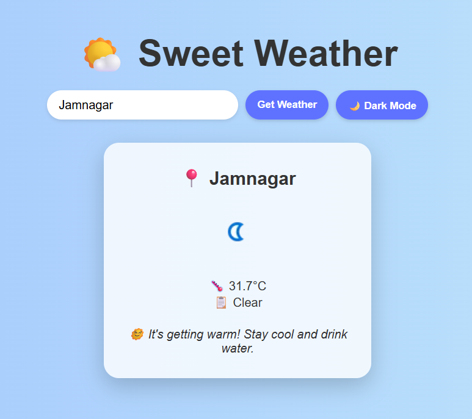
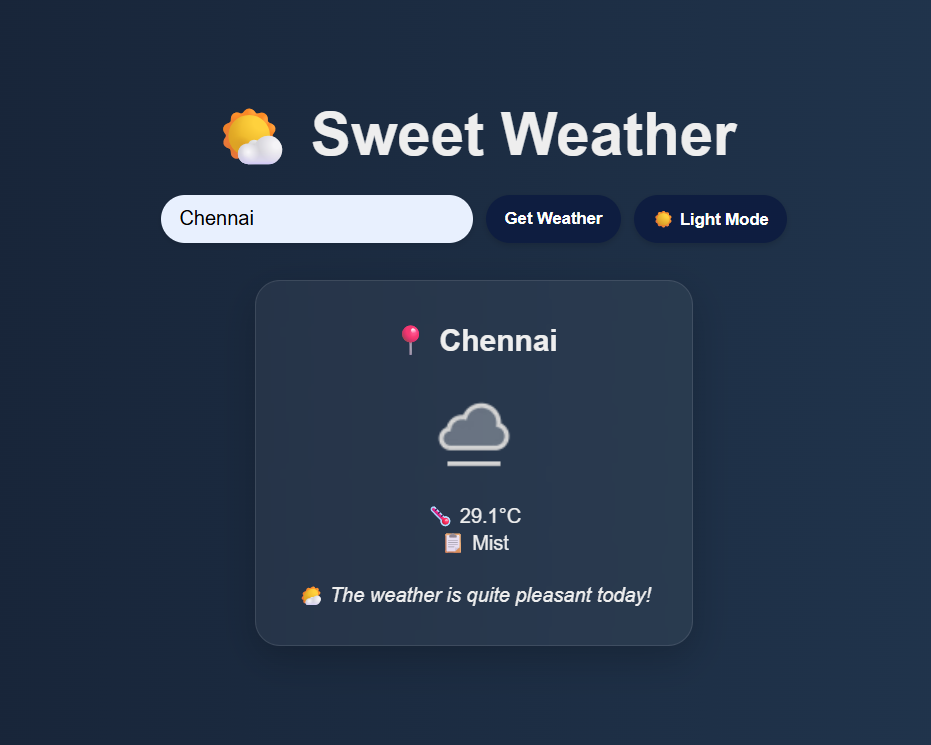

# Live-Weather
A simple and beautiful weather web app built with HTML, CSS, and JavaScript that lets you check the current weather in any city using the [WeatherAPI](https://www.weatherapi.com/). It also features a **Light/Dark theme toggle** for a personalized experience. ☀️🌙

---

## 📸 Screenshots

### ☀️ Light Mode


### 🌙 Dark Mode


---

## 🌐 Live Weather Data using WeatherAPI

This app fetches live weather data from the [WeatherAPI](https://www.weatherapi.com/).  
To use this API:

1. Go to [https://www.weatherapi.com/](https://www.weatherapi.com/)
2. Sign up for a free account
3. Navigate to **API Keys**
4. Copy your API key
5. Paste it into the `script.js` file:
   ```javascript
   const apiKey = "YOUR_API_KEY_HERE";

## 💡 Features
🔎 Search weather by location

🌡️ View temperature and condition

🧊 Displays helpful notes based on temperature (cold/hot/pleasant)

🌗 Toggle between Light and Dark mode

⚡ Responsive and clean UI

## 🚀 How to Run the Project
1. Clone this repository:
```
git clone https://github.com/Sivaraghavi/Live-Weather
```
2. Navigate to the project folder:
```
cd sweet-weather-app
```
Open index.html in your browser
*(No build or server needed – pure frontend project)*

## 📁 Folder Structure
```
sweet-weather-app/
├── index.html
├── style.css
├── script.js
├── LightMode.png
├── DarkMode.png
└── README.md
```
Thank you for exploring the Live Weather project! 

## Contact

For any questions or feedback, please reach out to us at [sivaraghavi6103@gmail.com](mailto:sivaraghavi6103@gmail.com).


